## The root-level data problem

You need feature flags available everywhere. Or a cart. Or user preferences. The classic approach: fetch the data in your root layout, `await` it, and pass the resolved value to a client context provider.

```tsx
// app/layout.tsx
export default async function RootLayout({ children }) {
  const cart = await getCart()       // ⏳ blocks everything
  const flags = await getFlags()     // ⏳ blocks everything

  return (
    <html>
      <body>
        <CartProvider cart={cart}>
          <FlagsProvider flags={flags}>
            {children}
          </FlagsProvider>
        </CartProvider>
      </body>
    </html>
  )
}
```

**The problem**: you're `await`-ing at the root. Nothing renders until those fetches resolve. Your entire page is held hostage by the slowest provider.

```mermaid
flowchart TD
    A(["Request arrives"]) --> B["await getCart() — 200ms"]
    B --> C["await getFlags() — 150ms"]
    C --> D["Render HTML"]
    D --> E["Send response — 350ms+ later"]

    style B fill:#fecaca,stroke:#dc2626,color:#000
    style C fill:#fecaca,stroke:#dc2626,color:#000
    style E fill:#fecaca,stroke:#dc2626,color:#000
```



Users stare at a blank screen for 350ms minimum. On slow connections or cold starts, this gets worse.

## Don't await. Forward.

React 19 introduced the `use()` hook, which can resolve promises inside client components. Combined with context, this unlocks a pattern: **start the fetch on the server, but don't wait for it. Pass the promise itself to the client.**

```tsx
// app/layout.tsx
export default function RootLayout({ children }) {
  const cartPromise = getCart()      // 🚀 started, not awaited
  const flagsPromise = getFlags()    // 🚀 started, not awaited

  return (
    <html>
      <body>
        <CartProvider cartPromise={cartPromise}>
          <FlagsProvider flagsPromise={flagsPromise}>
            {children}
          </FlagsProvider>
        </CartProvider>
      </body>
    </html>
  )
}
```

The layout returns immediately. The promises are in-flight. Client components resolve them when they're ready, wrapped in `<Suspense>`.


The shell renders immediately. Fetches resolve in parallel. Content streams in as each promise settles.

## The cart provider

Here's the full implementation. The provider stores the promise in context, and consumers use `use()` to unwrap it.

### The provider

```tsx showLineNumbers
// providers/cart-provider.tsx
'use client'

import { createContext, useContext, use } from 'react'

type CartItem = {
  id: string
  name: string
  quantity: number
  price: number
}

type Cart = {
  items: CartItem[]
  total: number
}

const CartContext = createContext<Promise<Cart> | null>(null)

export function CartProvider({
  children,
  cartPromise,
}: {
  children: React.ReactNode
  cartPromise: Promise<Cart>
}) {
  return <CartContext value={cartPromise}>{children}</CartContext>
}

export function useCart() {
  const cartPromise = useContext(CartContext)
  if (!cartPromise) throw new Error('useCart must be used within CartProvider')
  return use(cartPromise)
}
```

### Consuming it

```tsx showLineNumbers
// components/cart-count.tsx
'use client'

import { Suspense } from 'react'
import { useCart } from '@/providers/cart-provider'

function CartCountInner() {
  const cart = useCart() // use() suspends until resolved

  return (
    <span className="rounded-full bg-blue-600 px-2 py-0.5 text-xs text-white">
      {cart.items.length}
    </span>
  )
}

export function CartCount() {
  return (
    <Suspense fallback={<span className="h-5 w-5 animate-pulse rounded-full bg-gray-200" />}>
      <CartCountInner />
    </Suspense>
  )
}
```

```tsx showLineNumbers
// components/cart-total.tsx
'use client'

import { Suspense } from 'react'
import { useCart } from '@/providers/cart-provider'

function CartTotalInner() {
  const cart = useCart()

  return <span className="font-semibold">${cart.total.toFixed(2)}</span>
}

export function CartTotal() {
  return (
    <Suspense fallback={<span className="h-4 w-16 animate-pulse rounded bg-gray-200" />}>
      <CartTotalInner />
    </Suspense>
  )
}
```

Notice: every component that calls `useCart()` is wrapped in its own `<Suspense>`. This is the key. Each consumer independently suspends and resolves, showing its own loading state instead of blocking the entire page — suspension is handled per consumer.

### Wiring it in the layout

```tsx showLineNumbers
// app/layout.tsx
import { CartProvider } from '@/providers/cart-provider'
import { getCart } from '@/lib/cart'

export default function RootLayout({ children }: { children: React.ReactNode }) {
  const cartPromise = getCart() // Don't await

  return (
    <html>
      <body>
        <CartProvider cartPromise={cartPromise}>
          <Navbar />
          {children}
        </CartProvider>
      </body>
    </html>
  )
}
```

```tsx
// components/navbar.tsx
import { CartCount } from './cart-count'
import { CartTotal } from './cart-total'

export function Navbar() {
  return (
    <nav className="flex items-center justify-between border-b px-6 py-3">
      <span className="text-lg font-bold">Store</span>
      <div className="flex items-center gap-4">
        <CartTotal />
        <div className="flex items-center gap-1">
          🛒 <CartCount />
        </div>
      </div>
    </nav>
  )
}
```

The navbar renders instantly with skeleton placeholders. Cart data streams in when the promise resolves.

## The feature flags provider

Same pattern, different domain. Feature flags are fetched on the server, forwarded as a promise, and resolved on the client. Components that depend on flags show fallback UI until they're ready.

### The provider

```tsx showLineNumbers
// providers/flags-provider.tsx
'use client'

import { createContext, useContext, use } from 'react'

type FeatureFlags = {
  newCheckout: boolean
  darkMode: boolean
  betaBanner: boolean
  experimentalSearch: boolean
}

const FlagsContext = createContext<Promise<FeatureFlags> | null>(null)

export function FlagsProvider({
  children,
  flagsPromise,
}: {
  children: React.ReactNode
  flagsPromise: Promise<FeatureFlags>
}) {
  return <FlagsContext value={flagsPromise}>{children}</FlagsContext>
}

export function useFlags() {
  const promise = useContext(FlagsContext)
  if (!promise) throw new Error('useFlags must be used within FlagsProvider')
  return use(promise)
}

export function useFlag(flag: keyof FeatureFlags) {
  const flags = useFlags()
  return flags[flag]
}
```

### Conditional rendering with flags

```tsx showLineNumbers
// components/checkout-button.tsx
'use client'

import { Suspense } from 'react'
import { useFlag } from '@/providers/flags-provider'

function CheckoutButtonInner() {
  const newCheckout = useFlag('newCheckout')

  if (newCheckout) {
    return (
      <button className="rounded-lg bg-gradient-to-r from-blue-600 to-purple-600 px-6 py-3 text-white">
        Checkout with Express Pay
      </button>
    )
  }

  return (
    <button className="rounded-lg bg-gray-900 px-6 py-3 text-white">
      Proceed to Checkout
    </button>
  )
}

export function CheckoutButton() {
  return (
    <Suspense
      fallback={
        <button disabled className="rounded-lg bg-gray-300 px-6 py-3 text-gray-500">
          Loading...
        </button>
      }
    >
      <CheckoutButtonInner />
    </Suspense>
  )
}
```

### The data fetcher

```tsx showLineNumbers
// lib/flags.ts
import 'server-only'
import { cache } from 'react'
import { cookies } from 'next/headers'

export const getFlags = cache(async (): Promise<FeatureFlags> => {
  const userId = (await cookies()).get('userId')?.value

  const res = await fetch(`https://flags.example.com/api/flags?user=${userId}`, {
    next: { revalidate: 60 },
  })

  return res.json()
})
```

Using `React.cache` here means that if `getFlags()` is called multiple times in the same request (from the layout, from a page, from a server component), the fetch is deduplicated. One request, one fetch, many consumers.

## How PPR changes this

Without PPR, your page is fully static or fully dynamic. Using `cookies()` in the flags fetcher forces the entire route dynamic. Every request re-renders everything from scratch.

With **Partial Prerendering** (PPR), enabled via `cacheComponents: true` in Next.js 16, the page splits into two:

1. A **static shell** prerendered at build time (the HTML around your Suspense fallbacks)
2. **Dynamic holes** that stream at request time (the actual content inside those boundaries)


When a request comes in, the static shell is **instantly** served. Then the dynamic parts stream in:

```mermaid
flowchart TD
    A(["Static shell served — 0ms"]) --> S["UI renders with Suspense fallbacks instantly"]
    S --> B["getFlags resolves — 80ms"]
    S --> C["getCart resolves — 120ms"]

    B --> D["CheckoutButton renders<br/>Checkout with Express Pay"]
    C --> E["CartCount: 3<br/>CartTotal: $149.97"]

    D --> F(["Page fully interactive ~120ms"])
    E --> F

    style A fill:#bfdbfe,stroke:#2563eb,color:#000
    style S fill:#fef9c3,stroke:#ca8a04,color:#000
    style B fill:#bbf7d0,stroke:#16a34a,color:#000
    style C fill:#bbf7d0,stroke:#16a34a,color:#000
    style D fill:#e9d5ff,stroke:#7c3aed,color:#000
    style E fill:#e9d5ff,stroke:#7c3aed,color:#000
    style F fill:#bbf7d0,stroke:#16a34a,color:#000
```



Compare this to the traditional approach where nothing renders for 350ms.

## Before and after

### Without promise forwarding (traditional)

```mermaid
sequenceDiagram
    participant S as Server
    participant C as Client

    Note over C: Blank screen...
    S->>S: await getCart() — 200ms
    S->>S: await getFlags() — 150ms
    S->>S: Render full HTML
    S->>C: Send response (350ms+ later)
    C->>C: Display everything at once
    C->>C: Hydrate
    Note over S,C: Slow TTFB, fast render
```



### With promise forwarding + PPR


## The full rendering flow

Here's the complete picture of how a request flows through the system with promise forwarding and PPR:


## Rules of thumb

| Rule | Why |
|------|-----|
| **Don't `await` in the layout** | Awaiting blocks the entire render tree. Forward promises instead. |
| **Each consumer wraps itself in `<Suspense>`** | This lets each piece of dynamic content load independently with its own fallback. |
| **Use `React.cache` for the data fetcher** | Deduplicates across server components and the forwarded promise within one request. |
| **Use `server-only` on data fetchers** | Prevents accidental import of server code (secrets, DB access) into client bundles. |
| **Keep providers thin** | The provider just stores the promise in context. All logic lives in the consumers. |
| **Enable PPR** | `cacheComponents: true` in Next.js 16 gives you the static shell + streaming combo. |

## When to use this pattern

**Use it when:**
- You need data available throughout the app (auth, cart, flags, theme preferences)
- The data depends on the request (cookies, headers) making it inherently dynamic
- You want to avoid blocking the initial render while that data loads
- Multiple independent pieces of the page need the same data

**Skip it when:**
- Data is only used in one page or component (just fetch it there)
- Data is static and can be fetched at build time (use `use cache` instead)
- The component tree is shallow enough that prop drilling is clearer

## Enabling PPR in Next.js 16

In Next.js 16, PPR is enabled by setting `cacheComponents: true` in your `next.config.ts`. No per-route opt-in is needed — the static shell is the default behavior.

The dynamic holes inside your Suspense boundaries still execute at request time, but you can cache the functions powering them with the `'use cache'` directive and `cacheLife`:

```ts showLineNumbers
// lib/flags.ts
import { cacheLife } from 'next/cache'

export async function getFlags() {
  'use cache'
  cacheLife('minutes')

  const userId = (await cookies()).get('userId')?.value
  const res = await fetch(`https://flags.example.com/api/flags?user=${userId}`)
  return res.json()
}
```

This gives you three layers working together:

1. **Static shell from PPR** — prerendered at build time, served instantly from the CDN
2. **Cached dynamic content** — `'use cache'` + `cacheLife` lets the server return cached results instead of hitting the origin on every request
3. **Fresh fetches** — only when the cache expires does the server go back to the data source
