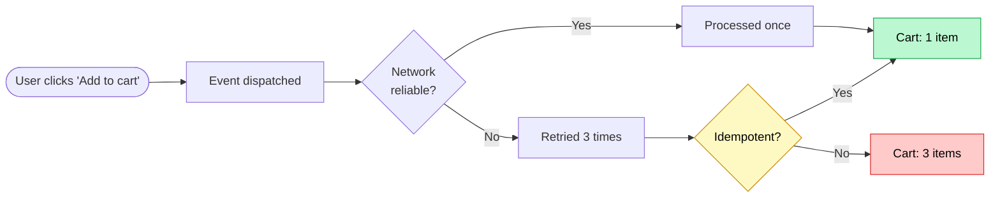
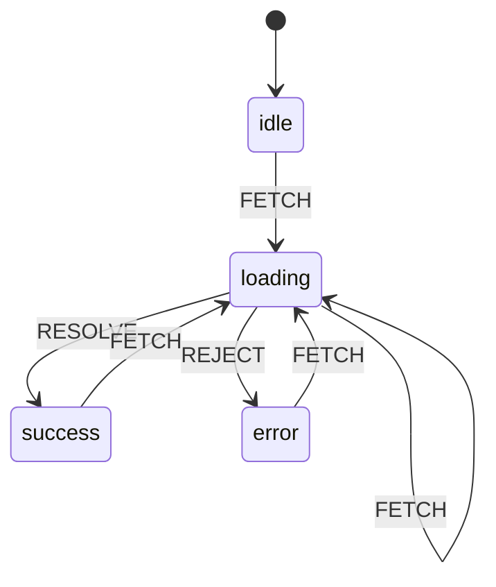
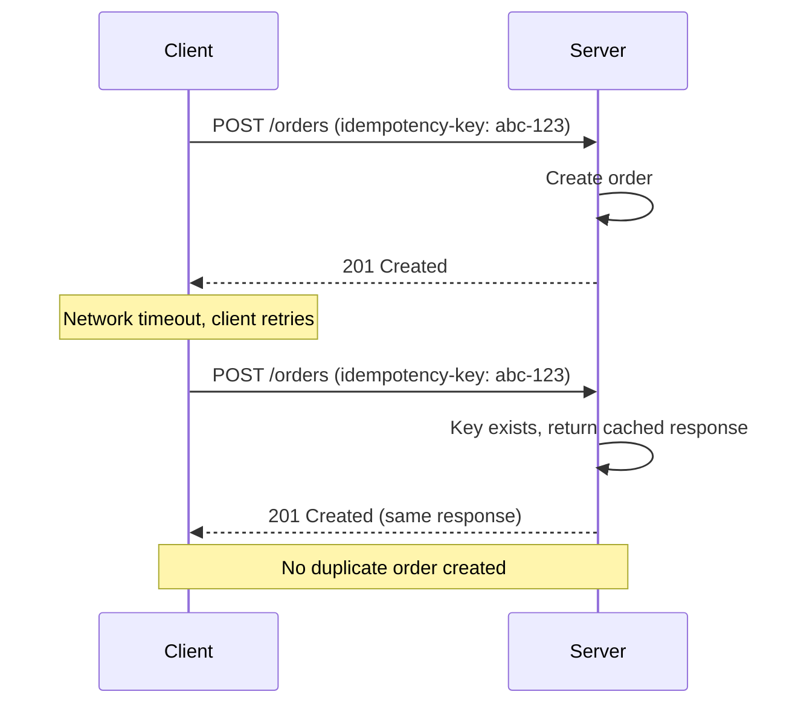
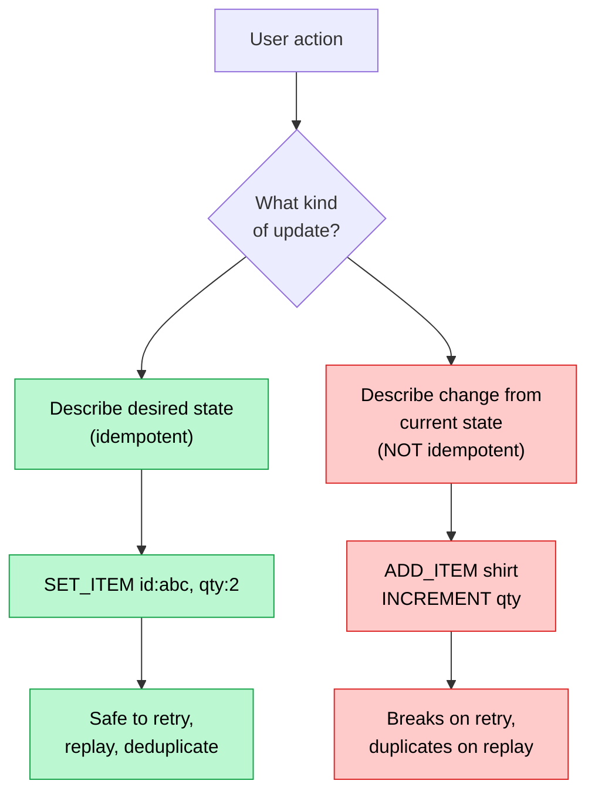

## Same action, same result. Every time.

An operation is **idempotent** if applying it once produces the same result as applying it multiple times. No matter how many times you run it, the system ends up in the same state.

```ts
// Idempotent: always produces the same state
user.role = 'admin'
user.role = 'admin'
user.role = 'admin'
// result: user.role === 'admin'

// NOT idempotent: result changes on each call
user.loginCount += 1
user.loginCount += 1
user.loginCount += 1
// result: loginCount is now 3 instead of 1
```

This isn't an academic distinction. It determines whether your state management is resilient or fragile.

## Why it matters

State updates don't always happen exactly once. In real systems, they can be triggered multiple times due to:

- React's `StrictMode` double-invoking effects
- Network retries on flaky connections
- Users double-clicking buttons
- WebSocket reconnections replaying messages
- Concurrent renders re-executing reducers

If your state updates aren't idempotent, every one of these scenarios is a bug waiting to happen.



## Non-idempotent state: the common traps

Most state bugs come from operations that assume they'll run exactly once.

### Trap 1: Relative updates

```ts
// Non-idempotent reducer
function cartReducer(state, action) {
  switch (action.type) {
    case 'ADD_ITEM':
      return {
        ...state,
        items: [...state.items, action.payload], // appends every time
      }
  }
}
```

If `ADD_ITEM` dispatches twice for the same product, you get a duplicate. The state depends on how many times the action fires, not what the user intended.

### Trap 2: Toggle-based logic

```ts
// Non-idempotent: result depends on current state
function toggleFavorite(state, productId) {
  if (state.favorites.includes(productId)) {
    return state.favorites.filter((id) => id !== productId)
  }
  return [...state.favorites, productId]
}
```

Call it once: favorited. Call it twice: unfavorited. Call it three times: favorited again. The result depends entirely on the number of invocations.

### Trap 3: Increment-based counters

```ts
// Non-idempotent: accumulates on every call
dispatch({ type: 'INCREMENT_UNREAD', count: 1 })
```

If a WebSocket reconnection replays this event, your unread count keeps climbing even though no new messages arrived.

```mermaid
flowchart TD
    subgraph nonIdem ["Non-Idempotent"]
        N1["State: 0 items"] --> N2["ADD_ITEM (shirt)"]
        N2 --> N3["State: 1 item"]
        N3 --> N4["ADD_ITEM (shirt)<br/>(retry)"]
        N4 --> N5["State: 2 items"]
    end

    subgraph idem ["Idempotent"]
        I1["State: 0 items"] --> I2["SET_ITEM (shirt, id:abc)"]
        I2 --> I3["State: 1 item"]
        I3 --> I4["SET_ITEM (shirt, id:abc)<br/>(retry)"]
        I4 --> I5["State: 1 item"]
    end

    style N5 fill:#fecaca,stroke:#dc2626,color:#000
    style I5 fill:#bbf7d0,stroke:#16a34a,color:#000
    style nonIdem fill:#fef2f2,stroke:#dc2626,color:#000
    style idem fill:#f0fdf4,stroke:#16a34a,color:#000
```



## Making state updates idempotent

The fix is always the same pattern: **describe the desired state, not the delta.**

### Pattern 1: Use identity-based sets, not arrays

Instead of appending to an array, use a `Map` or object keyed by a unique identifier.

```ts
// Idempotent: keyed by item ID
function cartReducer(state, action) {
  switch (action.type) {
    case 'SET_ITEM':
      return {
        ...state,
        items: {
          ...state.items,
          [action.payload.id]: action.payload, // same id = same slot
        },
      }
  }
}
```

Dispatching `SET_ITEM` with the same ID ten times results in one item. The ID is the natural deduplication key.

### Pattern 2: Explicit intent over toggles

Replace toggles with explicit actions that declare the target state.

```ts
// Idempotent: declares the end state
function favoritesReducer(state, action) {
  switch (action.type) {
    case 'SET_FAVORITE':
      return {
        ...state,
        favorites: new Set([...state.favorites, action.payload.id]),
      }
    case 'UNSET_FAVORITE':
      const next = new Set(state.favorites)
      next.delete(action.payload.id)
      return { ...state, favorites: next }
  }
}
```

`SET_FAVORITE` is idempotent: adding to a `Set` with an existing value is a no-op. `UNSET_FAVORITE` is idempotent too: deleting a non-existent key does nothing.

### Pattern 3: Absolute values over relative increments

```ts
// Non-idempotent
dispatch({ type: 'INCREMENT_UNREAD', by: 5 })

// Idempotent: set the count to what the server says
dispatch({ type: 'SET_UNREAD_COUNT', count: 12 })
```

The server is the source of truth. Don't calculate locally what the server already knows.

## The state machine approach

State machines are inherently idempotent. A transition from state A with event X always leads to state B, no matter how many times you fire X from A.



Notice that firing `FETCH` while already in `loading` keeps you in `loading`. There's no double-fetch, no accumulated side effects. The machine is its own guard.

```ts
type OrderState = 'idle' | 'loading' | 'success' | 'error'

type OrderAction =
  | { type: 'FETCH' }
  | { type: 'RESOLVE'; data: Order }
  | { type: 'REJECT'; error: string }

function orderReducer(state: { status: OrderState; data: Order | null; error: string | null }, action: OrderAction) {
  switch (state.status) {
    case 'idle':
    case 'success':
    case 'error':
      if (action.type === 'FETCH') {
        return { status: 'loading' as const, data: null, error: null }
      }
      return state // all other events are no-ops

    case 'loading':
      if (action.type === 'RESOLVE') {
        return { status: 'success' as const, data: action.data, error: null }
      }
      if (action.type === 'REJECT') {
        return { status: 'error' as const, data: null, error: action.error }
      }
      return state // FETCH while loading = no-op
  }
}
```

The key: events that don't match the current state are ignored. Duplicate events have no effect.

## Idempotency in API calls

State management doesn't end at the client. When your UI dispatches an action that hits an API, idempotency needs to carry through.



The pattern: generate a unique key on the client before the request. The server checks if it's seen that key before. If yes, return the original response. If no, process normally and cache the result against the key.

```ts
async function placeOrder(cart: Cart) {
  const idempotencyKey = crypto.randomUUID()

  return fetchWithRetry('/api/orders', {
    method: 'POST',
    headers: {
      'Idempotency-Key': idempotencyKey,
    },
    body: JSON.stringify(cart),
  })
}
```

The key is generated once and reused across retries. Same key, same result.

## Putting it together: idempotent cart

Here's a complete example that ties the patterns together: a cart context where every operation is idempotent.

```tsx showLineNumbers
'use client'

import { createContext, useContext, useReducer, useCallback } from 'react'

type CartItem = {
  id: string
  name: string
  price: number
  quantity: number
}

type CartState = {
  items: Record<string, CartItem> // keyed by ID, not an array
  status: 'idle' | 'saving' | 'saved' | 'error'
}

type CartAction =
  | { type: 'SET_ITEM'; item: CartItem }
  | { type: 'REMOVE_ITEM'; id: string }
  | { type: 'SET_QUANTITY'; id: string; quantity: number }
  | { type: 'SAVE_START' }
  | { type: 'SAVE_SUCCESS' }
  | { type: 'SAVE_ERROR' }

function cartReducer(state: CartState, action: CartAction): CartState {
  switch (action.type) {
    case 'SET_ITEM':
      // Idempotent: same ID always occupies the same slot
      return {
        ...state,
        items: { ...state.items, [action.item.id]: action.item },
      }

    case 'REMOVE_ITEM': {
      // Idempotent: removing a non-existent key is a no-op
      const { [action.id]: _, ...rest } = state.items
      return { ...state, items: rest }
    }

    case 'SET_QUANTITY':
      // Idempotent: sets absolute quantity, not relative
      if (!state.items[action.id]) return state
      return {
        ...state,
        items: {
          ...state.items,
          [action.id]: { ...state.items[action.id], quantity: action.quantity },
        },
      }

    case 'SAVE_START':
      // State machine: only transitions status
      return { ...state, status: 'saving' }

    case 'SAVE_SUCCESS':
      return { ...state, status: 'saved' }

    case 'SAVE_ERROR':
      return { ...state, status: 'error' }

    default:
      return state
  }
}
```

Every operation describes the target state. `SET_ITEM` with the same ID replaces, not duplicates. `REMOVE_ITEM` on a missing key does nothing. `SET_QUANTITY` sets an absolute value, not a delta.

## The mental model



If you can answer "what should the state be?" instead of "how should the state change?", you're writing idempotent code.

## Rules of thumb

| Rule | Why |
|------|-----|
| **Key everything by unique ID** | Maps and Sets naturally deduplicate. Arrays don't. |
| **Set absolute values, not deltas** | `SET_COUNT(5)` is idempotent. `INCREMENT(1)` is not. |
| **Replace toggles with explicit intent** | `SET_FAVORITE` / `UNSET_FAVORITE` over `TOGGLE_FAVORITE`. |
| **Use state machines for async flows** | Impossible states become unrepresentable. Duplicate events are no-ops. |
| **Send idempotency keys with mutations** | The server can safely deduplicate retries. |
| **Trust the server for derived values** | Don't locally compute what the server already knows. |

## When to think about this

**Always think about it when:**
- Handling events that can fire more than once (clicks, WebSocket messages, effects)
- Writing reducers or state updaters
- Building forms that submit to APIs
- Syncing state across tabs or devices
- Working with optimistic updates

**It's less critical when:**
- Rendering pure UI from props (no state transitions)
- Reading from a single source of truth with no local mutations
- Prototyping where correctness isn't the priority yet
