## The problem

You have a full-page WebGL canvas rendering content that needs to stay aligned with DOM elements as the user scrolls. Images, text blocks, sections -- all positioned by CSS, all mirrored as textured quads on the canvas.

During fast scrolls, the canvas content visibly drifts from the DOM. Images separate from their placeholders, snap back, separate again. It looks like jelly.

This isn't a bug. It's an architectural constraint of how browsers handle scroll.

## How browser compositing works

Modern browsers split rendering into two threads:

- **Main thread**: runs JavaScript, computes styles, performs layout, paints display lists
- **Compositor thread** (Chromium calls it the "impl thread"): composites rasterized layers, handles scroll input, runs GPU-side animations

When the user scrolls, the input event goes to the **compositor first**. The compositor immediately shifts pre-rasterized pixel tiles on the GPU -- no layout, no style recalc, no JS. That's why scrolling stays smooth even when the main thread is blocked.

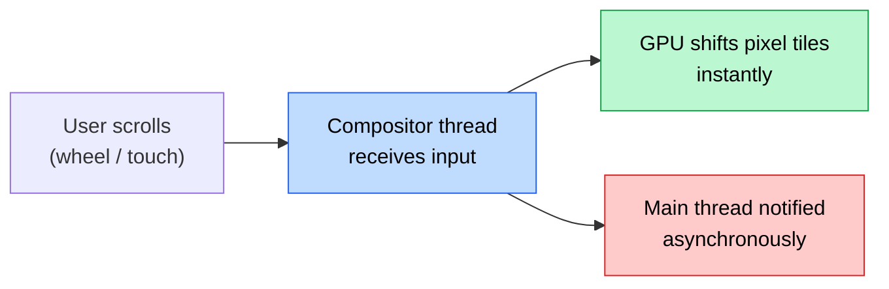

The compositor updates what the user sees **immediately**. The main thread gets the memo **later** -- at minimum one full frame later.

### The rendering pipeline

When JS modifies a transform via `requestAnimationFrame`, the change has to travel through Chromium's full pipeline before it reaches the screen:

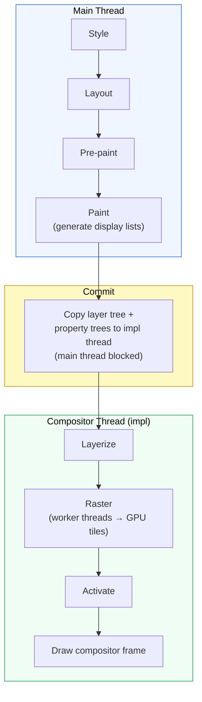

For compositor-driven scroll, **Style, Layout, and Paint can be entirely skipped**. The compositor just shifts rasterized tiles. But a JS-driven transform must travel the full path: rAF sets the value on the main thread → commit to impl thread → layerize → raster → activate → draw. Minimum 1-frame latency.

### The dual-tree model

Chromium maintains two completely isolated layer trees:

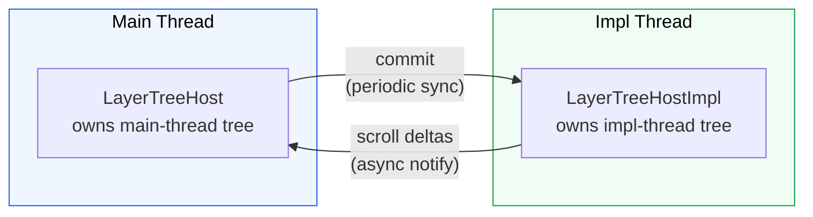

The impl tree is a snapshot from the last commit. Between commits, the impl thread scrolls, animates, and draws frames without consulting the main thread. When your rAF fires and reads `window.scrollY`, it's reading the scroll offset from the *last time the impl thread synced* -- not the impl thread's current position.

### The core tension

There are three things in play: the **window** (W, the viewport), the **page** (P, the document), and the **delta** (D, the scroll offset between them).

The compositor owns the delta. JS reads it late. The question is: where does your canvas live?

### Mapping DOM elements to WebGL

Regardless of which approach you pick, the fundamental operation is the same: each WebGL mesh tracks a DOM element's position. In Three.js with an orthographic camera where 1 unit = 1 pixel:

```ts showLineNumbers
// Orthographic camera: origin at top-left, Y points down (like DOM)
const camera = new THREE.OrthographicCamera(0, width, 0, -height, 0.1, 1000)
camera.position.z = 1

// On resize, store each element's absolute page position (doesn't change on scroll)
const pageY = rect.top + window.scrollY

// Every frame: convert page position → canvas position
function animate() {
  requestAnimationFrame(animate)

  const scrollOffset = window.scrollY

  // pageY is absolute (e.g. 3200px down the page)
  // scrollOffset is what the viewport currently shows
  // subtract to get the canvas-local position
  mesh.position.set(
    pageX + meshWidth / 2,
    -(pageY - scrollOffset + meshHeight / 2),
    0
  )

  renderer.render(scene, camera)
}
```

`scrollOffset` is the bridge between page space and canvas space. It's what makes a mesh at `pageY: 3200` appear at the right spot in your viewport-sized canvas. And it comes from `window.scrollY` -- which is always at least one frame behind the compositor.

**This is the root of the drift.** Every frame, your meshes are positioned with a `scrollOffset` that's already outdated. The question becomes: how do you architect around that staleness?

## Approach 1: Fixed + scroll hijack

The classic approach used by Locomotive Scroll, Lenis, GSAP ScrollSmoother, and most WebGL-heavy sites.

### How it works

The canvas is `position: fixed` -- it lives in **window** space. It doesn't participate in native scroll at all. You disable native scrolling on the content, keep the body tall for a scrollbar, and move everything yourself via JS.

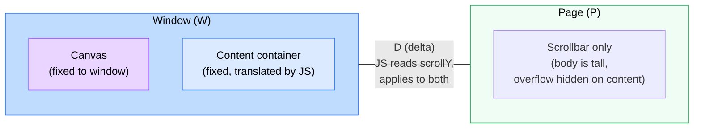

JS is the **single source of truth**. You read `scrollY` and apply it to both the HTML content and the canvas in the same `rAF` callback, before either one paints. The compositor never moves your content -- you do it all yourself.

```ts showLineNumbers
// The scroll hijack pattern
document.body.style.overflow = 'hidden'
document.body.style.height = `${contentHeight}px`
container.style.position = 'fixed'
container.style.top = '0'

let currentY = 0
const lerp = (a: number, b: number, t: number) => a + (b - a) * t

function animate() {
  requestAnimationFrame(animate)

  // JS is source of truth -- read scroll, lerp toward it
  currentY = lerp(currentY, window.scrollY, 0.1)

  // Apply to HTML content
  container.style.transform = `translate3d(0, ${-currentY}px, 0)`

  // Apply to WebGL camera (same value, same frame)
  camera.position.y = -currentY * scrollFactor
  renderer.render(scene, camera)
}
```

Because both the DOM content and the canvas are updated from the same `scrollY` read in the same frame, there's **zero drift** between them. The lerp smooths the input so per-frame deltas stay small.

### Why it works

The scroll hijack detaches the compositor from scroll entirely. No compositor scroll means no compositor/JS race. The cost: you've replaced the compositor's zero-latency GPU scrolling with main-thread JS scrolling.

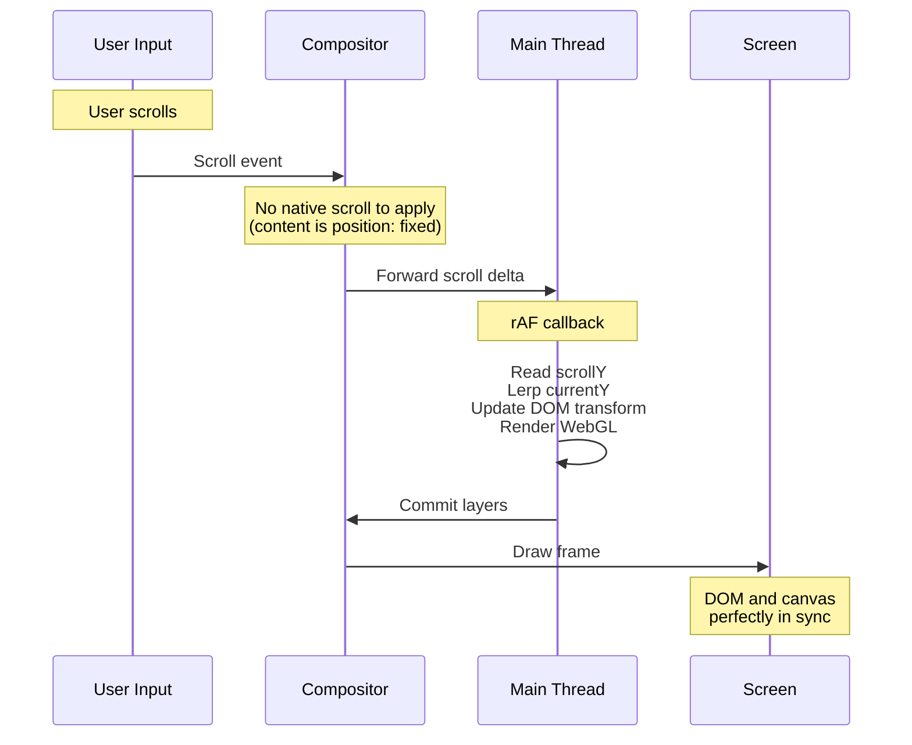

### The tradeoffs

The problem: you've killed native scroll. Every scroll frame now runs through the main thread.

- **Mobile lag**: On mobile, the main thread gets overloaded by touch handlers, GC pauses, and layout work. The smoothness users expect from native scroll is gone. It feels weirdly laggy.
- **Lost browser features**: Find-in-page, anchor link navigation, scroll restoration, accessibility (screen readers) -- all break or degrade.
- **Scroll-linked APIs**: `IntersectionObserver`, `scroll-snap`, CSS `scroll()` timeline -- all behave differently or break entirely because the browser doesn't see "real" scrolling.

### When to use it

When the entire experience is WebGL-driven and DOM is minimal. Think full-page immersive experiences where you control the whole viewport. The drift-free sync is worth the tradeoffs when there's not much DOM to break.

## Approach 2: Absolute

The approach used by [Lusion's webgl-scroll-sync](https://github.com/matiasperz/webgl-scroll-sync). Native scroll stays intact. The canvas moves with the page.

### How it works

The canvas is `position: absolute` -- it lives in **page** space, inside the scrolling container. It moves with the DOM naturally on the compositor thread. Each frame, JS reads `scrollY` and applies a `transform` to slide the canvas back into the viewport.

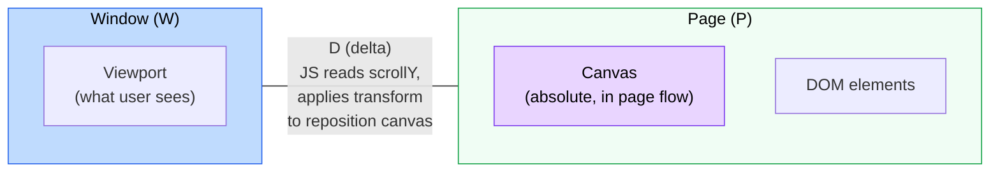

The canvas sits on the **P** side. The compositor moves the page -- and the canvas with it -- instantly. DOM elements and the canvas move together on the GPU. JS only needs to correct the canvas position and re-render the WebGL scene.

```ts showLineNumbers
// The absolute approach
const canvas = document.querySelector('#canvas')
// canvas CSS: position: absolute; left: 0;

const padding = 0.25 // 25% extra top and bottom
const canvasHeight = window.innerHeight * (1 + padding * 2)

function animate() {
  requestAnimationFrame(animate)

  const scrollY = window.scrollY
  const scrollOffset = scrollY - window.innerHeight * padding

  // Reposition canvas to cover viewport (+ padding)
  canvas.style.transform = `translate(0, ${scrollOffset}px)`

  // Update WebGL uniforms with scroll position
  // Each mesh knows its absolute page position (from getBoundingClientRect + scrollY)
  // The vertex shader subtracts scrollOffset to get canvas-local coordinates
  updateUniforms(scrollOffset)
  renderer.render(scene, camera)
}
```

### What drifts (and why it's ok)

The canvas and DOM move together on the compositor -- no content drift. The only stale thing is the `transform` correction that repositions the canvas over the viewport:

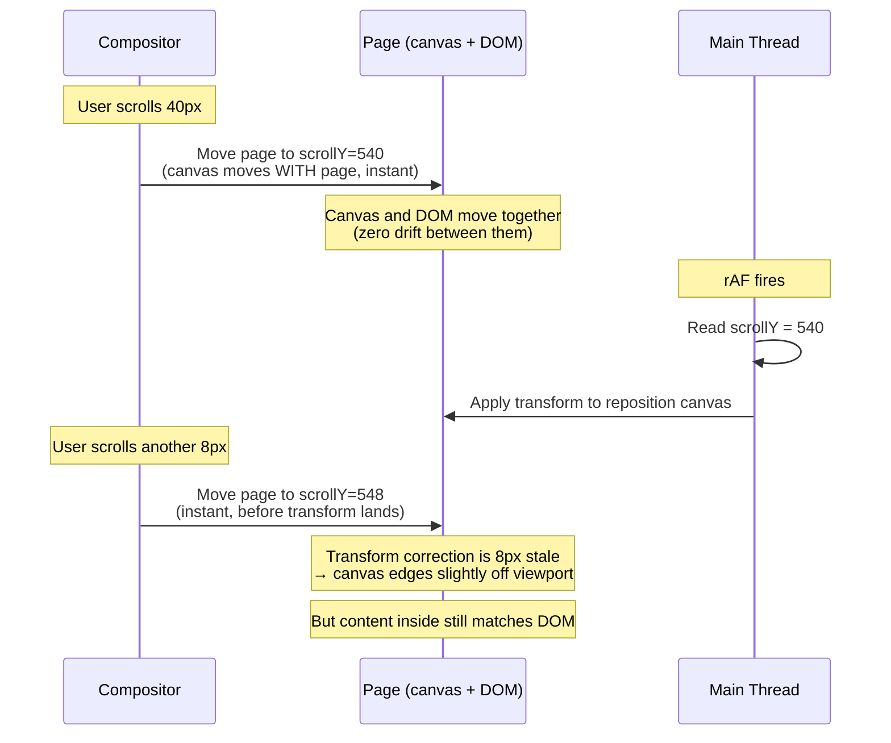

With the fixed approach, the **content** drifts (images separate from placeholders). With absolute, the **edges** drift (canvas doesn't perfectly cover the viewport). Content stays locked to the DOM.

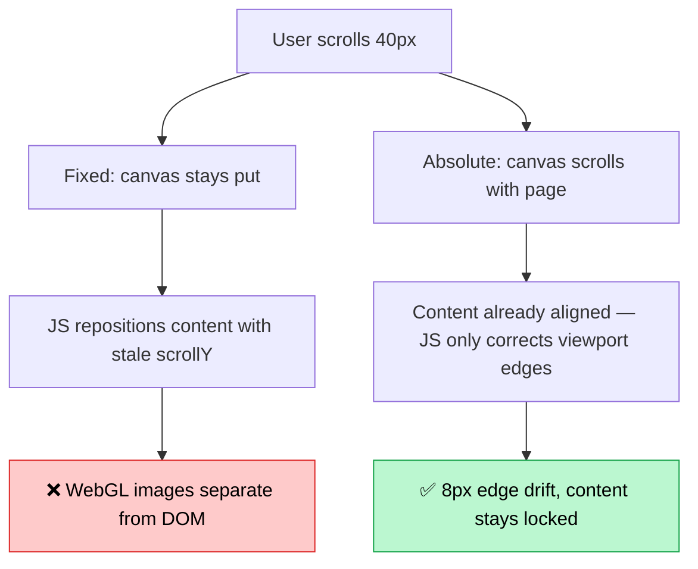

| | Fixed + hijack | Absolute |
|---|---|---|
| **Canvas lives in** | Window (W) | Page (P) |
| **What's stale** | Nothing (JS is source of truth) | The transform correction (W position) |
| **What drifts** | Nothing -- but native scroll is dead | Canvas edges vs viewport bounds |
| **Visible as** | Laggy scroll on mobile | Slight edge clipping during fast scroll |

### Solving the edge clipping with padding

Edge clipping during fast scroll is solved by rendering the canvas larger than the viewport. Add 25% vertical padding top and bottom (canvas = 150% viewport height). Even with a few frames of stale transform, the extra rendered area covers the viewport:

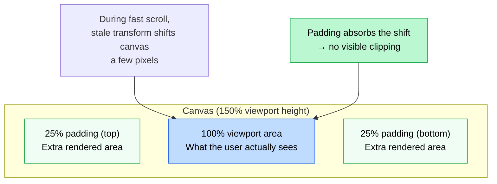

### The fixed-element problem

This is the main tradeoff of the absolute approach. The canvas lives on the **P** side -- that's the whole point, it moves with the page on the compositor. But what if you need to render a WebGL element that stays **fixed on screen**? A floating logo, a HUD, a persistent UI element -- all rendered on the canvas, not in the DOM.

To pin a WebGL element to the viewport, you'd need to counter-translate it by the scroll delta: subtract `scrollY` from its position so it stays put while everything else scrolls. But that `scrollY` is stale -- the compositor has already moved the canvas further than what JS knows. You're back to the exact same 1-frame lag that the fixed approach suffers from, just for this one element.

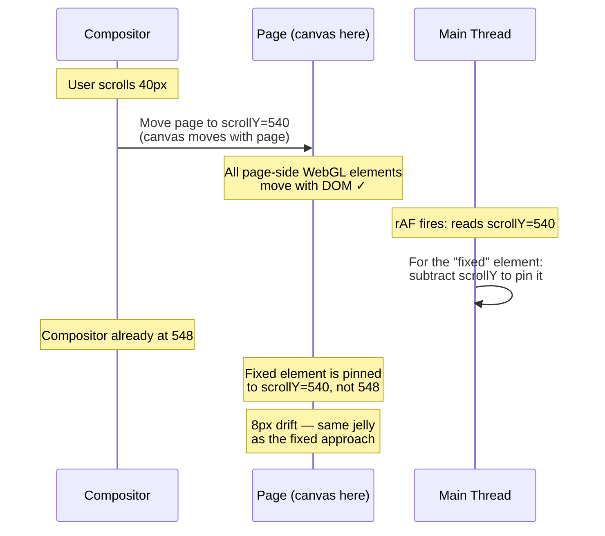

You chose the P side to get free compositor sync for page-bound content. But viewport-fixed content needs the delta from the W side -- and that delta is always stale. You can't have both: the compositor gives you one side for free, the other is always a frame behind.

This means the absolute approach works best when **all your WebGL content scrolls with the page**. The moment you need a viewport-pinned WebGL element, you're fighting the same battle the fixed approach fights for everything.

### When to use it

When all your WebGL content scrolls with the page -- background effects, image treatments, scroll-driven transitions. Native scroll stays intact. Browser features work. Accessibility works. The constraint: any WebGL element that needs to stay fixed on screen will drift, because you're back to reading a stale scroll delta from the other side.

## Summary

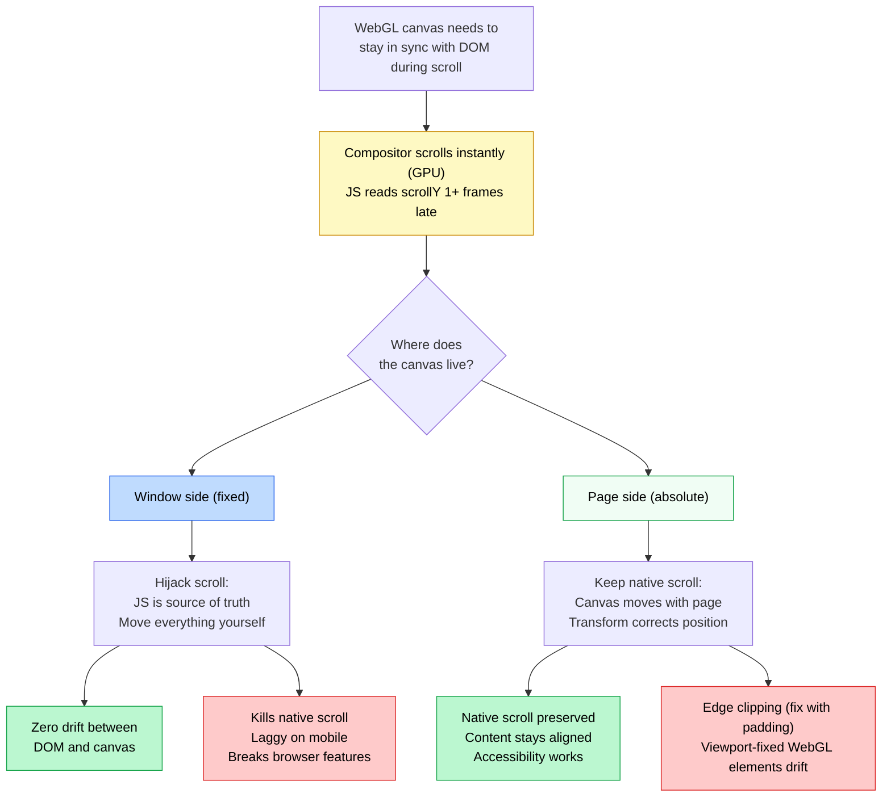

| | Fixed + scroll hijack | Absolute + padding |
|---|---|---|
| **Native scroll** | No | Yes |
| **DOM/canvas drift** | None | None (content-level) |
| **Edge clipping** | N/A | Solved with padding |
| **Viewport-fixed WebGL** | Works (canvas is already in window) | Drifts (stale delta from W side) |
| **Mobile performance** | Laggy (main thread scrolling) | Smooth (compositor scrolling) |
| **Browser features** | Broken (find, anchors, a11y) | Preserved |
| **Best for** | Full-page immersive WebGL | WebGL as enhancement layer |

The two approaches are mirror images of each other. The fixed canvas lives on the **window** side, so viewport-pinned WebGL elements work natively -- but tracking DOM elements requires scroll hijacking to keep them in sync. The absolute canvas lives on the **page** side, so DOM-tracked WebGL elements move with the page for free -- but pinning anything to the viewport requires the same scroll hijacking to fight the stale delta.

They sit on opposite sides of the same problem, and reach for the same escape hatch -- JS-driven scroll -- to cover their blind spot.

For a reference implementation of the absolute approach, see [webgl-scroll-sync](https://github.com/matiasperz/webgl-scroll-sync).
