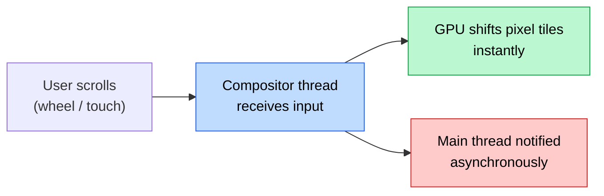
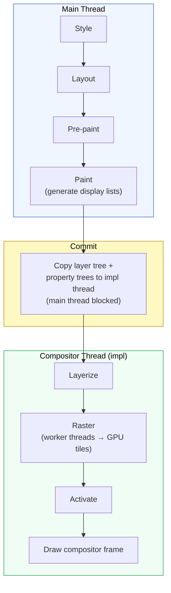
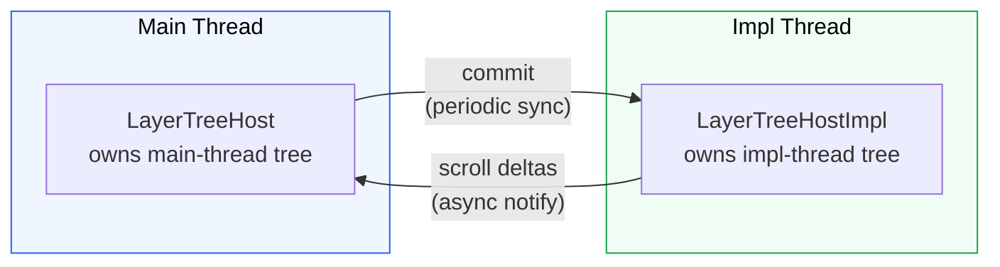
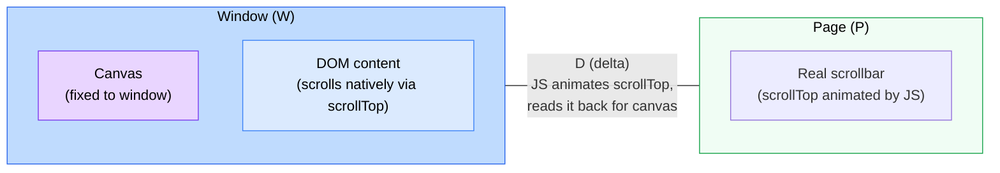
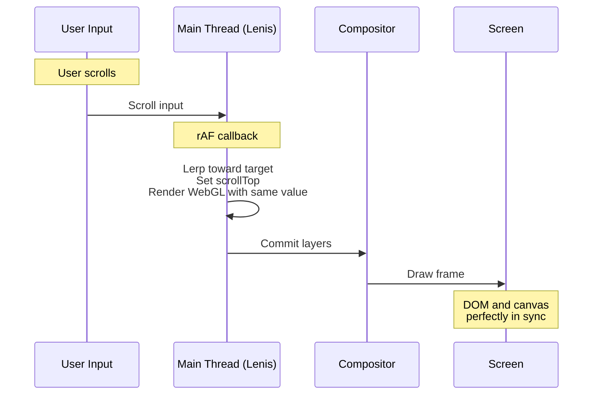
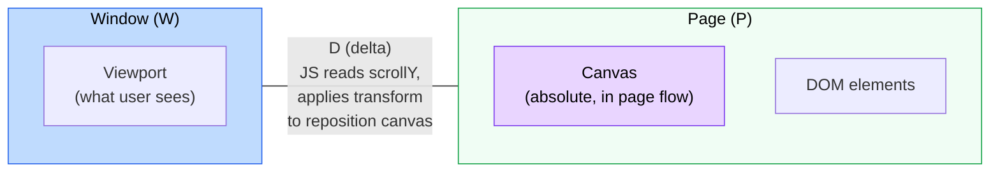
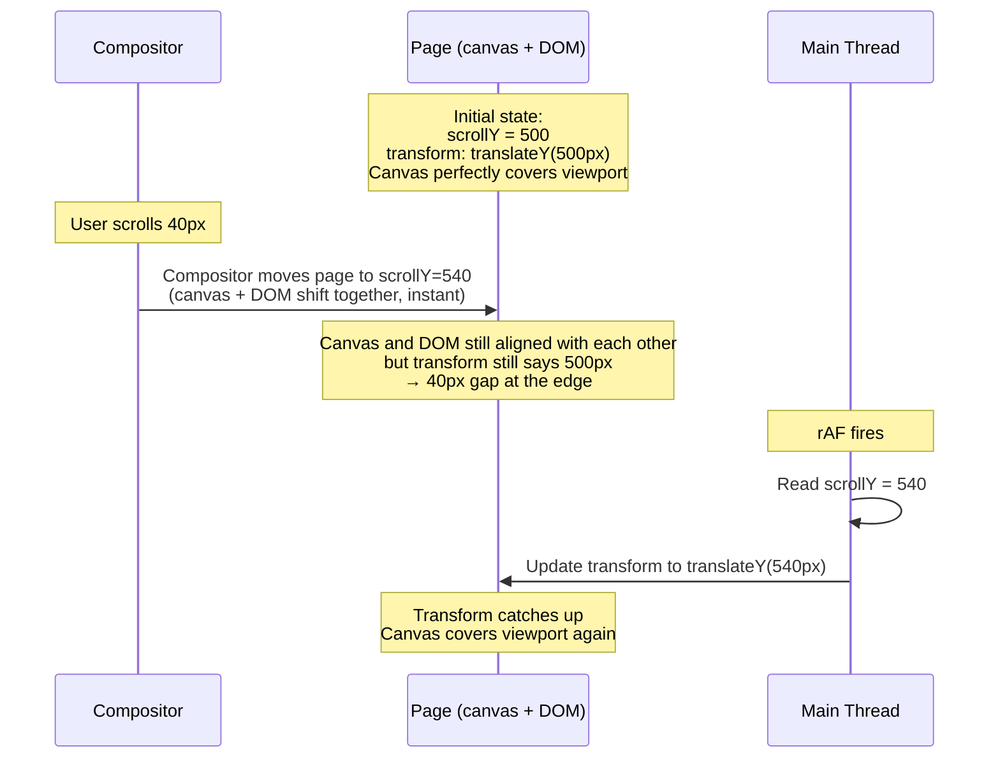
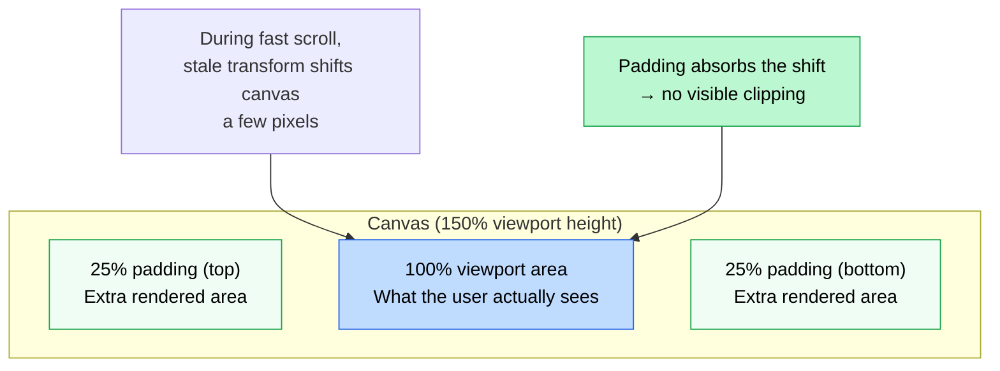
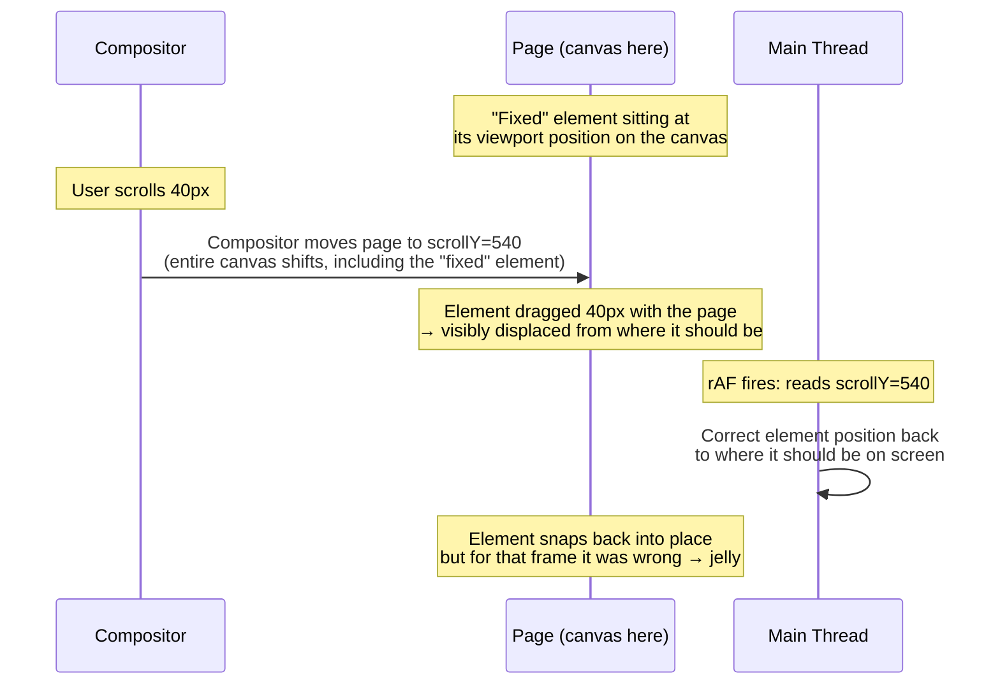
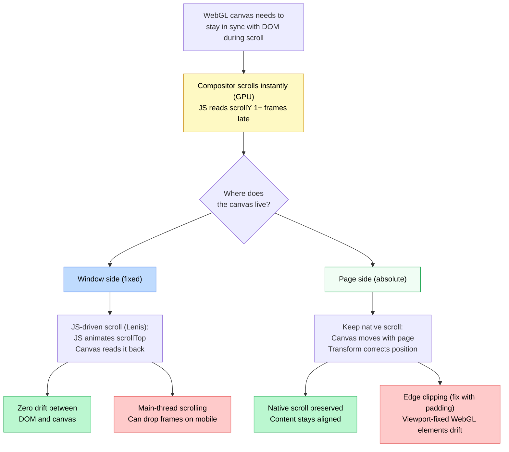

## The problem

You have a full-page WebGL canvas rendering content that needs to stay aligned with DOM elements as the user scrolls. Images, text blocks, sections, all positioned by CSS, all mirrored as textured quads on the canvas.

During fast scrolls, the canvas content visibly drifts from the DOM. Images separate from their placeholders, snap back, separate again. It looks like jelly.

This isn't a bug. It's an architectural constraint of how browsers handle scroll.

## How browser compositing works

Modern browsers split rendering into two threads:

- **Main thread**: runs JavaScript, computes styles, performs layout, paints display lists
- **Compositor thread** (Chromium calls it the "impl thread"): composites rasterized layers, handles scroll input, runs GPU-side animations

When the user scrolls, the input event goes to the **compositor first**. The compositor immediately shifts pre-rasterized pixel tiles on the GPU. No layout, no style recalc, no JS. That's why scrolling stays smooth even when the main thread is blocked.



The compositor updates what the user sees **immediately**. The main thread gets the memo **later**, at minimum one full frame later.

### The rendering pipeline

When JS modifies a transform via `requestAnimationFrame`, the change has to travel through Chromium's full pipeline before it reaches the screen:



For compositor-driven scroll, **Style, Layout, and Paint can be entirely skipped**. The compositor just shifts rasterized tiles. But a JS-driven transform must travel the full path: rAF sets the value on the main thread → commit to impl thread → layerize → raster → activate → draw. Minimum 1-frame latency.

### The dual-tree model

Chromium maintains two completely isolated layer trees:



The impl tree is a snapshot from the last commit. Between commits, the impl thread scrolls, animates, and draws frames without consulting the main thread. When your rAF fires and reads `window.scrollY`, it's reading the scroll offset from the *last time the impl thread synced*, not the impl thread's current position.

### The core tension

There are three things in play: the **window** (W, the viewport), the **page** (P, the document), and the **delta** (D, the scroll offset between them).

The compositor owns the delta. JS reads it late. The question is: where does your canvas live?

### Mapping DOM elements to WebGL

Regardless of which approach you pick, the fundamental operation is the same: each WebGL mesh tracks a DOM element's position. In Three.js with an orthographic camera where 1 unit = 1 pixel:

```ts showLineNumbers
// Orthographic camera: origin at top-left, Y points down (like DOM)
const camera = new THREE.OrthographicCamera(0, width, 0, -height, 0.1, 1000)
camera.position.z = 1

// On resize, store each element's absolute page position (doesn't change on scroll)
const pageY = rect.top + window.scrollY

// Every frame: convert page position → canvas position
function animate() {
  requestAnimationFrame(animate)

  const scrollOffset = window.scrollY

  // pageY is absolute (e.g. 3200px down the page)
  // scrollOffset is what the viewport currently shows
  // subtract to get the canvas-local position
  mesh.position.set(
    pageX + meshWidth / 2,
    -(pageY - scrollOffset + meshHeight / 2),
    0
  )

  renderer.render(scene, camera)
}
```

`scrollOffset` is the bridge between page space and canvas space. It's what makes a mesh at `pageY: 3200` appear at the right spot in your viewport-sized canvas. And it comes from `window.scrollY`, which is always at least one frame behind the compositor.

**This is the root of the drift.** Every frame, your meshes are positioned with a `scrollOffset` that's already outdated. The question becomes: how do you architect around that staleness?

## Approach 1: JS-driven scroll (Lenis)

The approach used by [Lenis](https://lenis.darkroom.engineering/) and most WebGL-heavy sites. Unlike older libraries that used `position: fixed` with fake scrollbars, Lenis animates `scrollTop` directly. There's real native scroll, but the main thread drives it.

### How it works

The canvas is `position: fixed`. It lives in **window** space. Lenis takes over scroll by animating `scrollTop` on each frame via `requestAnimationFrame`. The browser sees real scroll events, so browser features (find-in-page, anchors, accessibility) still work. But because JS is setting `scrollTop`, the main thread controls the pace.



JS is the **single source of truth**. On each frame, Lenis lerps toward the target scroll position, sets `scrollTop`, and your rAF callback reads it back for the canvas. Because both the DOM scroll and the WebGL render happen from the same value in the same frame, there's **zero drift** between them.

```ts showLineNumbers
// Lenis-style: JS animates scrollTop, canvas reads it back
const lenis = new Lenis()

function animate(time: number) {
  requestAnimationFrame(animate)

  lenis.raf(time)

  // Lenis has already set scrollTop for this frame
  // Read it back for the canvas
  const scrollY = lenis.scroll

  // Update WebGL meshes with the same scroll value
  camera.position.y = -scrollY * scrollFactor
  renderer.render(scene, camera)
}
```

### Why it works

JS drives `scrollTop` each frame, so the compositor and JS are always in agreement. There's no race. The DOM scrolls to exactly where JS told it to, and the canvas renders with the same value.



### The tradeoffs

Every scroll frame runs through the main thread. The compositor isn't driving scroll independently. JS is.

- **Mobile performance**: On mobile, the main thread competes with touch handlers, GC pauses, and layout work. Under heavy load, scroll frames can drop and feel sluggish compared to compositor-driven native scroll.
- **Scroll-linked APIs**: `scroll-snap`, CSS `scroll()` timeline, and other compositor-coupled features may behave differently since scroll timing is JS-controlled.

### When to use it

When you need drift-free DOM/canvas sync and your page can tolerate main-thread scrolling. Works well for portfolio sites, landing pages, and experiences where the smooth lerp is part of the design language.

## Approach 2: Absolute

The approach used by [Lusion's webgl-scroll-sync](https://github.com/matiasperz/webgl-scroll-sync). Native scroll stays intact. The canvas moves with the page.

### How it works

The canvas is `position: absolute`. It lives in **page** space, inside the scrolling container. It moves with the DOM naturally on the compositor thread. Each frame, JS reads `scrollY` and applies a `transform` to slide the canvas back into the viewport.



The canvas sits on the **P** side. The compositor moves the page, and the canvas with it, instantly. DOM elements and the canvas move together on the GPU. JS only needs to correct the canvas position and re-render the WebGL scene.

```ts showLineNumbers
// The absolute approach
const canvas = document.querySelector('#canvas')
// canvas CSS: position: absolute; left: 0;

const padding = 0.25 // 25% extra top and bottom
const canvasHeight = window.innerHeight * (1 + padding * 2)

function animate() {
  requestAnimationFrame(animate)

  const scrollY = window.scrollY
  const scrollOffset = scrollY - window.innerHeight * padding

  // Reposition canvas to cover viewport (+ padding)
  canvas.style.transform = `translate(0, ${scrollOffset}px)`

  // Update WebGL uniforms with scroll position
  // Each mesh knows its absolute page position (from getBoundingClientRect + scrollY)
  // The vertex shader subtracts scrollOffset to get canvas-local coordinates
  updateUniforms(scrollOffset)
  renderer.render(scene, camera)
}
```

### What drifts (and why it's ok)

The canvas and DOM move together on the compositor, with no content drift. The only stale thing is the `transform` correction that repositions the canvas over the viewport. Here's what a single scroll looks like:



The compositor scroll creates a delta between where the canvas sits (page space) and where JS last told it to sit (the transform). That delta is the edge drift. It only lasts until the next frame when JS catches up. The content inside the canvas never drifts from the DOM because they're on the same side of the compositor.

| | JS-driven scroll (Lenis) | Absolute |
|---|---|---|
| **Canvas lives in** | Window (W) | Page (P) |
| **What's stale** | Nothing (JS drives scrollTop) | The transform correction (W position) |
| **What drifts** | Nothing, but scroll is main-thread bound | Canvas edges vs viewport bounds |
| **Visible as** | Dropped frames under load | Slight edge clipping during fast scroll |

### Solving the edge clipping with padding

Edge clipping during fast scroll is solved by rendering the canvas larger than the viewport. Add 25% vertical padding top and bottom (canvas = 150% viewport height). Adding this padding buffer lets the translate catch up when the impl layer syncs. Even with a few frames of stale transform, the extra rendered area covers the viewport:



### The fixed-element problem

This is the main tradeoff of the absolute approach. The canvas lives on the **P** side. That's the whole point, it moves with the page on the compositor. But what if you need to render a WebGL element that stays **fixed on screen**? A floating logo, a HUD, a persistent UI element, all rendered on the canvas, not in the DOM.

To keep a WebGL element fixed on screen, you don't need to translate anything. It would just sit at its viewport position. The problem is that the canvas is on the page side. When the compositor scrolls, it takes the entire canvas with it, including your "fixed" element. That compositor scroll instantly displaces it. JS hasn't caught up yet, so for that frame the element slides with the page when it should have stayed put. That's the jelly. The element gets dragged by the compositor scroll until the next rAF where JS can correct it back.



You chose the P side to get free compositor sync for page-bound content. But viewport-fixed content gets dragged by the compositor scroll every frame, snapping back only when JS catches up. You can't have both: the compositor gives you one side for free, the other is always a frame behind.

This means the absolute approach works best when **all your WebGL content scrolls with the page**. The moment you need a viewport-pinned WebGL element, you're fighting the same jelly effect.

### When to use it

When all your WebGL content scrolls with the page: background effects, image treatments, scroll-driven transitions. Native scroll stays intact. Browser features work. The constraint: any WebGL element that needs to stay fixed on screen will drift, because you're back to reading a stale scroll delta from the other side.

## Summary



| | JS-driven scroll (Lenis) | Absolute + padding |
|---|---|---|
| **Scroll driven by** | Main thread (JS animates scrollTop) | Compositor (native) |
| **DOM/canvas drift** | None | None (content-level) |
| **Edge clipping** | N/A | Solved with padding |
| **Viewport-fixed WebGL** | Works (canvas is already in window) | Drifts (stale delta from W side) |
| **Mobile performance** | Can drop frames under load | Smooth (compositor scrolling) |

The two approaches are mirror images of each other. The fixed canvas lives on the **window** side, so viewport-pinned WebGL elements work natively, but tracking DOM elements requires JS-driven scroll to keep them in sync. The absolute canvas lives on the **page** side, so DOM-tracked WebGL elements move with the page for free, but pinning anything to the viewport requires the same JS-driven scroll to fight the stale delta.

They sit on opposite sides of the same problem, and reach for the same escape hatch to cover their blind spot.

For a reference implementation of the absolute approach, see [webgl-scroll-sync](https://github.com/matiasperz/webgl-scroll-sync).
